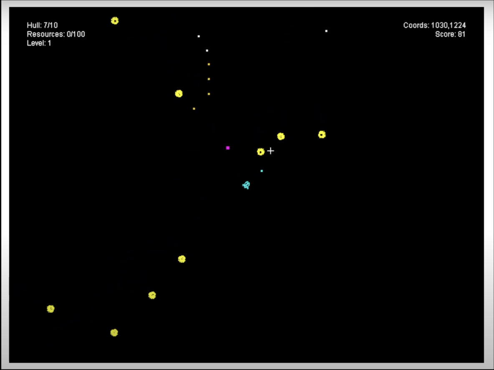

# Turrets, Lasers and More
A roguelike, survival game where you control a lone spacecraft drifting through space filled with dangers.



## Development

### Requirements

* Java Development Kit 17
* A Java IDE (Eclipse or IDEA)

### Design Pattern Used

1. **Singleton**  
   use to load sprite on [SpriteCache](src/main/java/io/github/moonslanding/tlm/engine/SpriteCache.java) and Create an
   instance of managers things
2. **Observer**  
   use as event Listener on [GameScene](src/main/java/io/github/moonslanding/tlm/engine/GameScene.java)
3. **Composite**  
   used to equip weapons for player on [PlayerShip](src/main/java/io/github/moonslanding/tlm/entities/PlayerShip.java)
4. **Object Pool**  
   used to manage and reuse resources on managers things such
   as [ProjectileManager](src/main/java/io/github/moonslanding/tlm/managers/ProjectileManager.java)
   and [ResourceEntityManager](src/main/java/io/github/moonslanding/tlm/managers/ResourceEntityManager.java)
5. **Flyweight**  
   use [SpriteCache](src/main/java/io/github/moonslanding/tlm/engine/SpriteCache.java) to preload images

### How to play

* Double click file `tlm-1.0.0.jar` or type ```java -jar tlm-1.0.0.jar``` on your terminal
* Use `W` to move up
* Use `A` to move left
* Use `S` to move down
* Use `D` to move right
* Use mouse to aim an enemy or direction of the bullet

## Team Member

1. 6410545525 Pawitchaya Chaloeijanya
2. 6410546165 Thanadol Udomsirinanchai
3. 6410546203 Preawpan Thamapipol